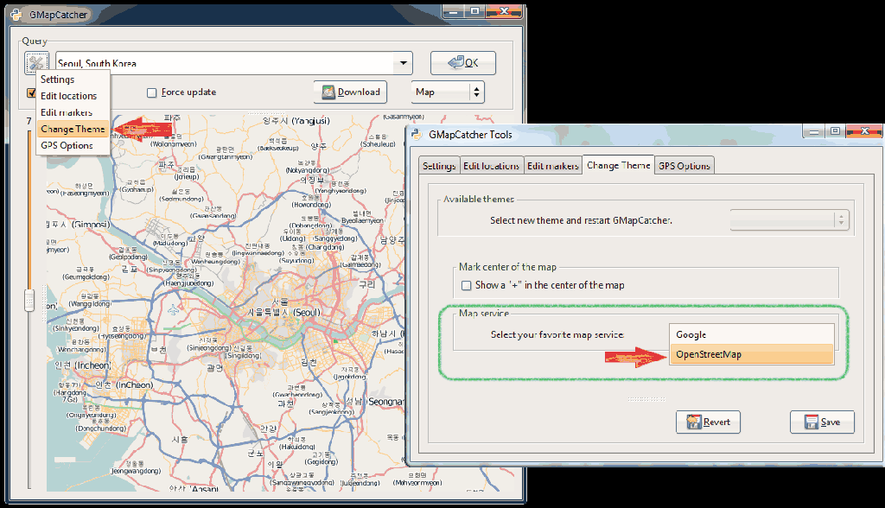
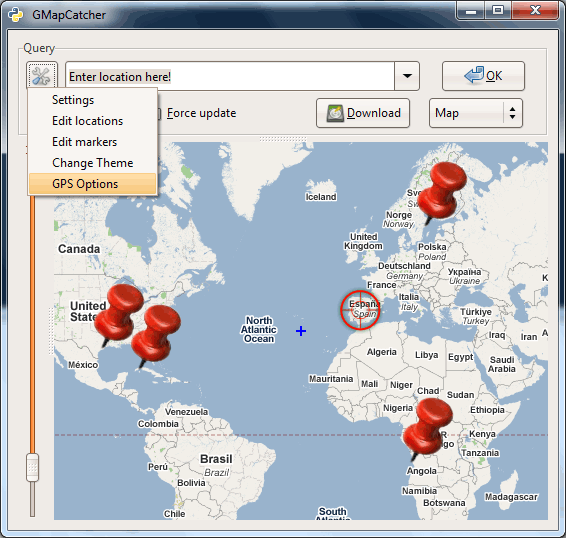
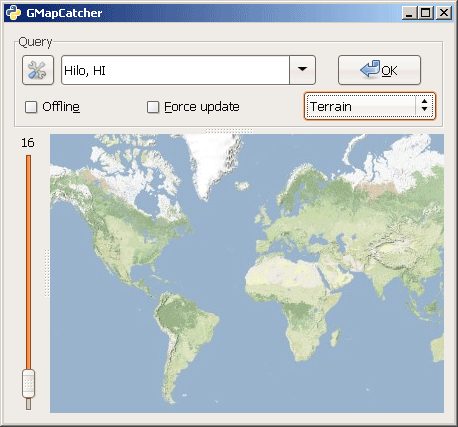
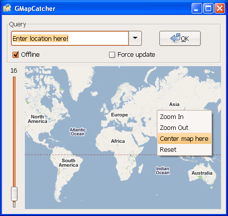
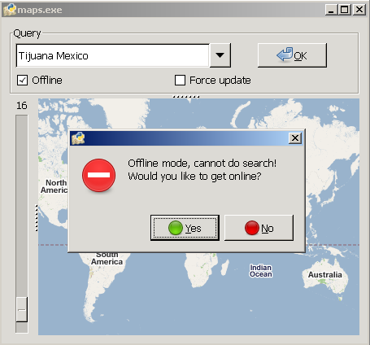
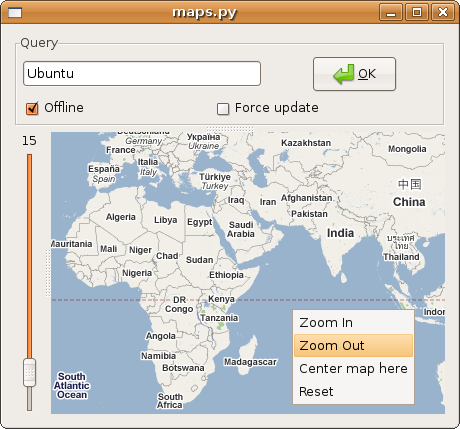
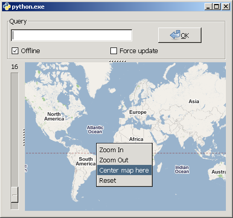
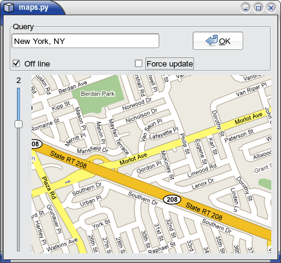

#summary Some Screenshots
#labels Featured

#### GMapCatcher v0.7.7.1 ####
Showing the font capabilities 

<h4>GMapCatcher v0.6</h4>
Showing the new Right-Click Actions 

<h4>GMapCatcher v0.4</h4>
adding a few new map providers 

<h4>GMapCatcher v0.1</h4>
integration with <a href='http://www.openstreetmap.org/'>OpenStreetMap</a> 

<h4>GMapCatcher v0.09</h4>
showing new features 

<h4>GMapCatcher v0.054</h4>
Some kool features, thanks to Maxim.Razin !!! 

We have a New look under Windows. 

<h4>GMapCatcher v0.050</h4>
Win XP & Ubuntu Showing the new Features. 

<h4>GMapCatcher v0.046</h4>
In Ubuntu. 

<h4>GMapCatcher v0.043</h4>
In Windows XP (showing right click menu) 

